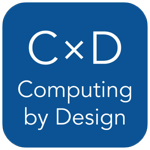
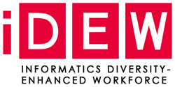

# Computing by Design \(CxD\)

**Computing by Design** \(CxD\) is a growing collection of project guidebooks for use in high school computer science courses. In each project, student teams collaboratively design and build a solution to a problem within a particular context using emerging technologies.

## Project Guidebooks

The CxD guidebooks are designed for use by students and teachers alike. Each project guidebook has an associated code guidebook that provides coding tutorials and references.

| PROJECT TITLE | PROJECT DURATION |
| :--- | :--- |
|  [Trivia App](https://docs.idew.org/project-trivia-app/) | 12+ Weeks |
|  [Robotics](https://docs.idew.org/project-robotics/) | 16 Weeks |
|  [Internet of Things \(IoT\)](https://docs.idew.org/project-internet-of-things/) | 16 Weeks |
|  [Video Game](https://docs.idew.org/project-video-game/) | 16 Weeks |
|  [Chatbot ](https://docs.idew.org/project-chatbot/) | 16 Weeks |
|  [Data Visualization](https://docs.idew.org/project-dataviz-dashboard/) | 8+ Weeks |

These projects are designed to follow the research-based ["Gold Standard" model of Project Based Learning \(PBL\)](https://www.pblworks.org/what-is-pbl) developed by the Buck Institute of Education. Visit BIE's [PBLWorks](https://www.pblworks.org/) website for more information and resources on PBL.

In parallel to each project, we also recommend students create and share one or more [research reports on topics in computing](https://docs.idew.org/research-topics-in-computing/):

* Trends and Innovations in Computing
* Privacy and Ethics in Computing
* Degrees and Careers in Computing

The CxD curriculum materials are **free** to use, share, or adapt for non-commercial purposes under a [Creative Commons license](https://creativecommons.org/licenses/by-nc-sa/4.0/). Our team periodically updates the CxD materials to improve them, so be aware that revisions may occur.

## Student Outcomes

Computing by Design projects emphasize computational thinking, design thinking, and project management. Throughout each project, students will engage in creative thinking, critical thinking, communication, and collaboration.

Computing by Design projects are intended to show students [there are many paths to working in technology](https://techpoint.org/jobs-in-tech/) and to help them find their own pathway to success.

The goals of Computing by Design include:

* Broaden student enrollment in computer science courses
* Help students become creators and innovators of technology
* Help students develop the skills essential for success in the 21st century
* Increase the number and diversity of students pursuing degrees and careers in technology

## Student Work

Visit the [iDEW Galleries](https://galleries.idew.org/) to see examples of project proposals and other key deliverables posted by some of our student teams.

## iDEW Program

The Computing by Design projects were created for the [Informatics Diversity-Enhanced Workforce \(iDEW\)](https://soic.iupui.edu/idew/) program, an award-winning community partnership in central Indiana that is broadening student participation in computing and helping students develop the skills essential for success in the 21st century workplace.

The iDEW program managed by the [Indiana University School of Informatics and Computing at IUPUI](https://soic.iupui.edu/). If your school or organization wants to get involved with iDEW as a partner, please contact [Vicki Daugherty](https://soic.iupui.edu/people/vicki-daugherty/), iDEW Program Manager.

## Copyright and License

Copyright © 2015-2019 by Jim Lyst and Michael Frontz, Indiana University School of Informatics and Computing at IUPUI

This work is licensed under a [Creative Commons Attribution-NonCommercial-ShareAlike 4.0 International License](http://creativecommons.org/licenses/by-nc-sa/4.0/). You are free to use, share, or adapt this material for non-commercial purposes as long as you provide proper attribution and distribute any copies or adaptations under this same license.

